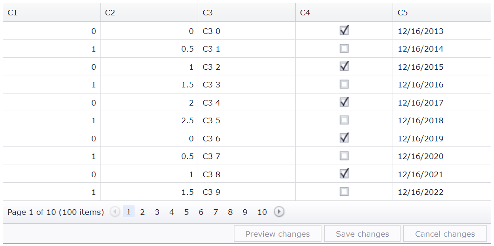

<!-- default badges list -->

[](https://supportcenter.devexpress.com/ticket/details/E430)
[](https://docs.devexpress.com/GeneralInformation/403183)
<!-- default badges end -->
# Grid View for ASP.NET Web Forms - How to implement a single cell edit feature
<!-- run online -->
**[[Run Online]](https://codecentral.devexpress.com/128540907/)**
<!-- run online end -->

This example demonstrates how to edit a grid cell in batch mode and update the data source on a callback.



## Overview

Follow the steps below to configure a single cell's edit functionality:

1. Create the [Grid View](https://docs.devexpress.com/AspNet/DevExpress.Web.ASPxGridView) control, bind it to a data source, and set the grid's [Mode](https://docs.devexpress.com/AspNet/DevExpress.Web.ASPxGridViewEditingSettings.Mode) property to `Batch`. Add a callback panel to the page.

    ```aspx
    <dx:ASPxGridView ID="ASPxGridView1" runat="server" ClientInstanceName="grid" KeyFieldName="ID">
        <!-- ... -->
        <ClientSideEvents BatchEditEndEditing="onBatchEditEndEditing" />
        <SettingsEditing Mode="Batch">
            <BatchEditSettings StartEditAction="Click" ShowConfirmOnLosingChanges="false" />
        </SettingsEditing>
        <Columns>
            <!-- ... -->
    </dx:ASPxGridView>
    <dx:ASPxCallback ID="ASPxCallback" runat="server" ClientInstanceName="callback" OnCallback="ASPxCallback_Callback">
        <ClientSideEvents CallbackComplete="onEndUpdateCallback" />
    </dx:ASPxCallback>
    ```

2. Handle the grid's client-side [BatchEditEndEditing](https://docs.devexpress.com/AspNet/js-ASPxClientGridView.BatchEditEndEditing) event. In the handler, call the [BatchEditApi.GetEditCellInfo](https://docs.devexpress.com/AspNet/js-ASPxClientGridViewBatchEditApi.GetEditCellInfo) method to get the value of the edited cell and use the callback panel's [PerformCallback](https://docs.devexpress.com/AspNet/js-ASPxClientCallback.PerformCallback(parameter)) method to pass that value to the server.

    ```js
    function onBatchEditEndEditing(s, e) {
        var cellInfo = s.batchEditApi.GetEditCellInfo();
        setTimeout(function() {
            if (s.batchEditApi.HasChanges(cellInfo.rowVisibleIndex, cellInfo.column.index))
                UpdateEdit(createObject(s, s.GetRowKey(e.visibleIndex), e.rowValues), cellInfo);
        }, 0);
    }
    function UpdateEdit(object, cellInfo) {
        callback.cpCellInfo = cellInfo;
        callback.PerformCallback(JSON.stringify(object));
    }

    function createObject(grid, key, values) {
        // ...
        return object;
    }
    ```

3. Handle the panel's server-side [Callback](https://docs.devexpress.com/AspNet/DevExpress.Web.ASPxCallback.Callback) event to update the data source and specify the resulting text string.

    ```csharp
    protected void ASPxCallback_Callback(object source, DevExpress.Web.CallbackEventArgs e) {
        try {
            GridDataItem.UpdateData(JsonConvert.DeserializeObject<GridDataItem>(e.Parameter));
            e.Result = "OK";
        }
        catch(Exception ex) {
            e.Result = ex.Message;
        }
    }
    ```

4. To focus the modified cell when server-side validation fails, handle the panel's client-side [CallbackComplete](https://docs.devexpress.com/AspNet/js-ASPxClientCallback.CallbackComplete) event.


## Files to Review

* [GridDataItem.cs](./CS/App_Code/Models/GridDataItem.cs) (VB: [GridDataItem.vb](./VB/App_Code/Models/GridDataItem.vb))
* [Default.aspx](./CS/Default.aspx) (VB: [Default.aspx](./VB/Default.aspx))
* [Default.aspx.cs](./CS/Default.aspx.cs) (VB: [Default.aspx.vb](./VB/Default.aspx.vb))

## Documentation

* [Grid in Batch Edit Mode](https://docs.devexpress.com/AspNet/16443/components/grid-view/concepts/edit-data/batch-edit-mode)
* [Callbacks](https://docs.devexpress.com/AspNet/402559/common-concepts/callbacks)

## More Examples

* [Grid View for ASP.NET MVC - How to implement a single cell edit feature](https://github.com/DevExpress-Examples/how-to-implement-a-single-cell-editing-feature-in-gridview-t498424)
